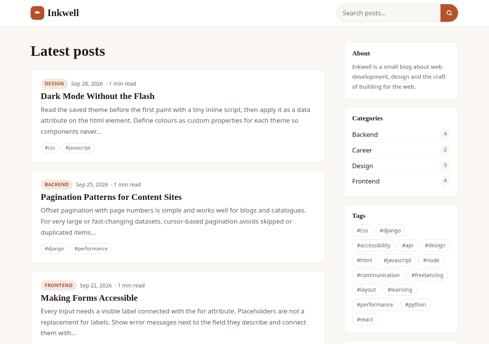
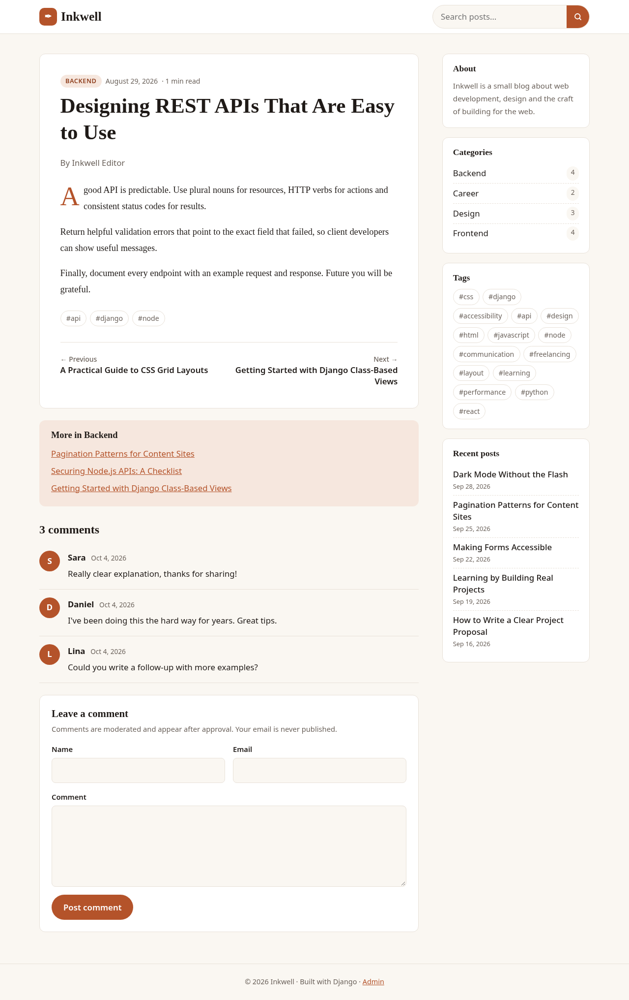
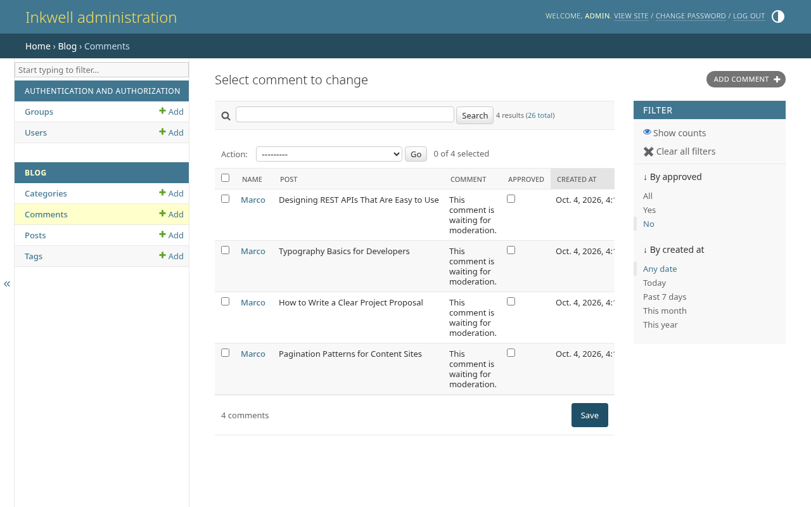
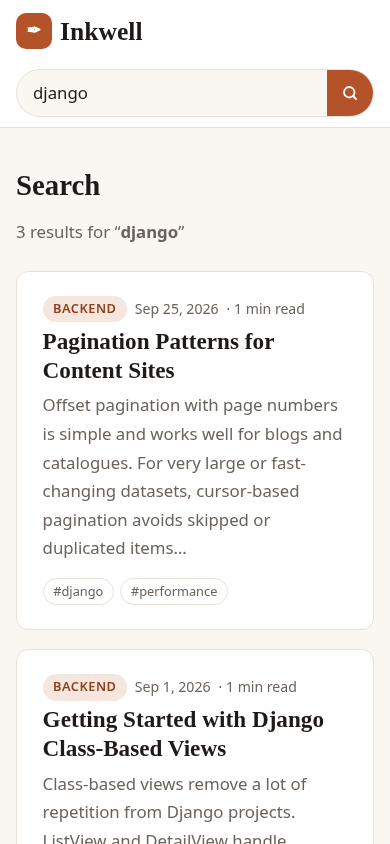

# ✒️ Inkwell

A clean, responsive **Django** blog with server-rendered templates: posts, categories, tags, full-text search, moderated comments, pagination and a customised Django admin. Comes with a `seed_blog` management command so you can explore it with realistic demo content in seconds.

> Portfolio project by **Amir Namvar** – full-stack web developer.

---

## ✨ Features

- **Posts** with title, slug, excerpt (auto-generated if empty), body, category, tags, author, draft/published status and scheduled publish date.
- **Categories & tags** – dedicated listing pages, post counts and a tag cloud in the sidebar.
- **Search** – multi-word search across titles, excerpts, bodies, tags and categories.
- **Comments with moderation** – new comments are saved as *pending* and only appear after approval in the admin. Includes server-side validation and a honeypot field against spam bots.
- **Admin** – list filters, search, inline comments on posts, bulk actions (*publish*, *move to draft*, *approve*, *unapprove*) and editable status / approval columns.
- **Draft preview** – staff users can open draft posts; visitors get a 404.
- **Pagination** – 6 posts per page (configurable with `BLOG_POSTS_PER_PAGE`), also on search results.
- **Post page extras** – reading time, previous / next navigation and related posts from the same category.
- **Responsive editorial design** – plain CSS, no framework; sidebar collapses below the content on small screens.
- **Accessible** – semantic HTML, labelled form fields, skip link, visible focus styles.
- **Custom 404 page** and environment-based settings (`DEBUG`, `SECRET_KEY`, `ALLOWED_HOSTS`).
- **Tests** – 11 tests covering listing, pagination, filters, search, drafts and comment moderation.

## 🛠 Tech Stack

| Layer     | Technology |
|-----------|------------|
| Backend   | Python 3.10+, Django 5.2 (class-based views, ORM, admin, messages framework) |
| Templates | Django template language, server-side rendering |
| Styling   | Plain CSS with custom properties |
| Database  | SQLite (default) – any Django-supported database works |
| Testing   | Django `TestCase` |

## 📸 Screenshots

| Home | Post & comments |
|------|-----------------|
|  |  |

| Comment moderation (admin) | Mobile search |
|----------------------------|---------------|
|  |  |

## 🚀 Getting Started

### Prerequisites

- **Python** 3.10 or newer

### Setup

```bash
git clone https://github.com/som-info/inkwell-blog.git
cd inkwell-blog

python -m venv .venv
source .venv/bin/activate          # Windows: .venv\Scripts\activate
pip install -r requirements.txt

python manage.py migrate
python manage.py seed_blog         # demo categories, tags, posts and comments
python manage.py createsuperuser   # account for the admin
python manage.py runserver
```

- Blog: <http://127.0.0.1:8000/>
- Admin: <http://127.0.0.1:8000/admin/> — approve pending comments under **Blog → Comments** (filter *By approved → No*).

Re-seed from scratch at any time with `python manage.py seed_blog --reset`.

### Run the tests

```bash
python manage.py test blog
```

### Environment variables

| Variable               | Default                 | Description |
|------------------------|-------------------------|-------------|
| `DJANGO_DEBUG`         | `true`                  | Set to `false` in production |
| `DJANGO_SECRET_KEY`    | dev-only key            | **Required** when `DJANGO_DEBUG=false` |
| `DJANGO_ALLOWED_HOSTS` | `localhost,127.0.0.1`   | Comma-separated host names |
| `DJANGO_DB_PATH`       | `db.sqlite3`            | SQLite database file |

See `.env.example`. For production, also run `python manage.py collectstatic` and serve the app with a WSGI server such as Gunicorn behind a reverse proxy.

## 🧭 URLs

| URL                    | Page |
|------------------------|------|
| `/`                    | Latest published posts (paginated) |
| `/post/<slug>/`        | Post detail, approved comments and comment form |
| `/category/<slug>/`    | Posts in a category |
| `/tag/<slug>/`         | Posts with a tag |
| `/search/?q=<terms>`   | Search results |
| `/admin/`              | Django admin |

## 📁 Project Structure

```
inkwell-blog/
├── blog/                         # blog app
│   ├── management/commands/
│   │   └── seed_blog.py          # demo data command
│   ├── migrations/
│   ├── templates/blog/           # post_list, post_detail, search + partials
│   ├── admin.py                  # admin config, moderation actions
│   ├── context_processors.py     # sidebar data (categories, tags, recent posts)
│   ├── forms.py                  # CommentForm with honeypot
│   ├── models.py                 # Category, Tag, Post, Comment
│   ├── tests.py
│   ├── urls.py
│   └── views.py                  # class-based list / detail / search views
├── inkwell/                      # project settings and root URLs
├── templates/                    # base.html, 404.html
├── static/css/style.css
├── docs/screenshots/
├── .env.example
├── manage.py
├── requirements.txt
├── LICENSE
└── README.md
```

## 🗺 Possible Improvements

- Markdown support with sanitised HTML output
- RSS feed and XML sitemap (`django.contrib.syndication`, `django.contrib.sitemaps`)
- PostgreSQL full-text search with ranking
- Email notification to the editor when a new comment needs moderation

## 📄 License

This project is licensed under the [MIT License](LICENSE).

---

Made with ❤️ by [Amir Namvar](https://github.com/som-info)
